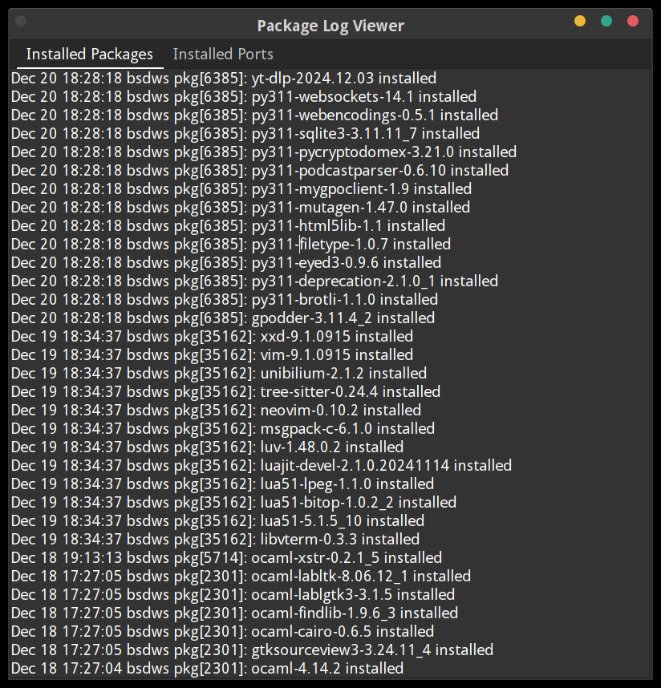
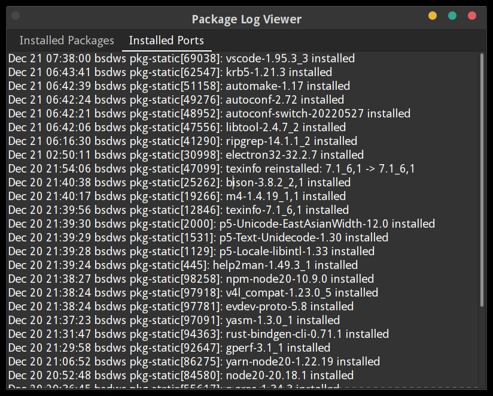

# Package Log Viewer

**Package Log Viewer** is a lightweight desktop application built with OCaml and GTK3. It provides an intuitive interface to view and analyze logs of installed packages and ports on FreeBSD systems. 

## Features

- **Installed Packages Tab**: Displays logs for installed packages (`pkg`).
- **Installed Ports Tab**: Displays logs for installed ports (`pkg-static`).
- **Real-time Insights**: Logs are sorted by timestamp, with the most recent entries displayed at the top.
- **User-Friendly Interface**: Organized into tabs for easy navigation.

## Requirements

- FreeBSD or GhostBSD
- OCaml (4.14.0 or compatible)
- `lablgtk3`
- `str`
- GTK3

## Installation

### 1. Install Dependencies

Ensure OCaml and the required packages are installed:

```bash
opam install lablgtk3 str
```

### 2. Clone the Repository

```bash
git clone https://github.com/vimanuelt/package_log_viewer
cd package_log_viewer
```

### 3. Compile the Application

```bash
ocamlfind ocamlc -thread -package lablgtk3,str -linkpkg -o package_log_viewer package_log_viewer.ml
```

### 4. Run the Application

```bash
./package_log_viewer
```

## Usage

1. Launch the application.
2. View the **Installed Packages** tab for logs related to `pkg`.
3. Switch to the **Installed Ports** tab for logs related to `pkg-static`.

The logs are sorted with the newest entries displayed at the top.

## Screenshots





## Contributing

Contributions are welcome! If you find a bug or have suggestions for improvements, feel free to submit an issue or a pull request.

## License

This project is licensed under the MIT License. See the `LICENSE` file for details.

---

### Notes

- Default log path: `/var/log/messages`. Adjust the path in the code if your logs are stored elsewhere.
- If you have ideas for a better application name, suggestions are welcome! 😉

