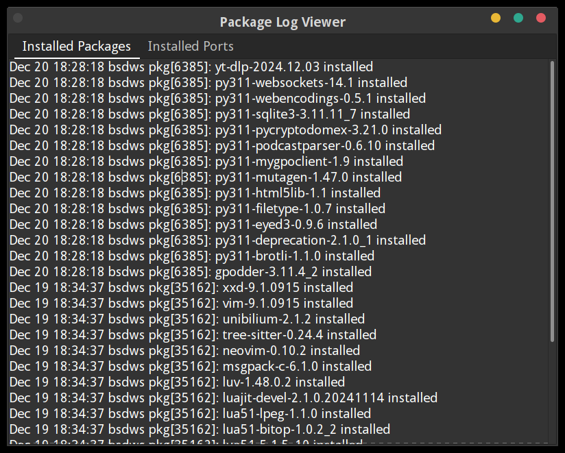

# Package Log Viewer

**Package Log Viewer** is a lightweight desktop application developed in OCaml using GTK3. It provides an intuitive interface to view and analyze logs of installed packages and ports on FreeBSD-based systems.

## Features

- **Installed Packages Tab**: Displays logs for installed packages (`pkg`).
- **Installed Ports Tab**: Displays logs for installed ports (`pkg-static`).
- **Sorted by Time**: Logs are organized with the newest entries displayed at the top for quick insights.
- **Tabbed Interface**: Easy-to-navigate tabs for streamlined log viewing.
- **Scrollable Views**: Integrated scroll bars for convenient navigation through log entries.

## Requirements

- **Operating System**: FreeBSD or GhostBSD
- **OCaml Version**: 4.14.0 or compatible
- **GTK3 runtime environment**

> **Note**: All required OCaml dependencies are installed automatically via the Makefile.

## Installation

### 1. Clone the Repository

```bash
git clone https://github.com/vimanuelt/package_log_viewer.git
cd package_log_viewer
```

### 2. Build the Application Using Makefile

Run the following command to install dependencies and compile the application:

```bash
make
```

### 3. Run the Application

Once compiled, launch the application with:

```bash
./plv
```

## Usage

1. Launch the application.
2. View the **Installed Packages** tab for logs related to installed packages (`pkg`).
3. Switch to the **Installed Ports** tab for logs related to installed ports (`pkg-static`).
4. Scroll through the logs for detailed information.

The logs are sorted with the newest entries displayed at the top to help you quickly find recent events.

## Screenshots

### Installed Packages Tab


### Installed Ports Tab


## Contributing

Contributions are welcome! Here's how you can help:

- **Report Bugs**: If you encounter any issues, please submit them via the issue tracker.
- **Suggest Enhancements**: Have ideas for new features or improvements? We'd love to hear from you.
- **Submit Pull Requests**: Feel free to fork the repository, make your changes, and submit a pull request.

## License

This project is licensed under the MIT License. See the [LICENSE](LICENSE) file for more details.

---

### Notes

- **Default Log Path**: The application reads logs from `/var/log/messages` by default. Update the path in the code if your logs are stored elsewhere.
- **Future Updates**: We're considering renaming the application. If you have creative suggestions, please share them! 😉
- **Compatibility**: Designed specifically for FreeBSD-based systems. Functionality may vary on other platforms.
